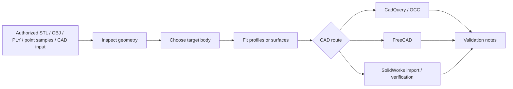

# Curved Surface Reconstruction AgentSkill

## Language

[English](#english) | [中文](#中文)

---

<a id="english"></a>

## English

<p align="center">
  <strong>A practical workflow for reconstructing curved products, soft goods, and closed solids.</strong><br />
  Inspect the source geometry, keep the intended main body, fit reconstruction profiles, export CAD-ready files, and keep validation results with the deliverable.
</p>

<p align="center">
  
  
  
  
</p>

### Overview

This repository provides an AgentSkill and a small set of supporting tools for reverse-modeling curved geometry. It is intended for cases where a raw mesh, point sample, or CAD handoff needs to be turned into cleaner profiles, a STEP solid, or a documented CAD workflow.

The project is not a one-click mesh-to-solid converter. It focuses on the steps that usually decide whether a reconstruction is usable: checking the input, separating the real target body from surrounding details, fitting ordered sections, exporting through the right CAD route, and recording what was verified.

Typical outputs include:

- cleaned or inspected mesh data;
- fitted profile JSON for section-based reconstruction;
- STEP and preview STL files from the CadQuery/OCC route;
- optional SolidWorks import and verification results;
- notes that explain what was included, what was ignored, and what quality level was reached.

### Skill File

The main workflow file is:

```text
SKILL.md
```

Use it when a coding/CAD assistant needs a repeatable procedure for curved-surface reconstruction. It covers:

- when the workflow should be used;
- input and output expectations;
- authorization checks for source geometry;
- quality levels from mesh repair to verified native CAD;
- main-body filtering rules;
- section, spline, and end-cap rules;
- validation requirements before delivery.

### Gallery

The images below show the kind of evidence this workflow keeps with a reconstruction: what was selected, what was rebuilt, and what was handed off.

<table>
  <tr>
    <td align="center">
      
      <br />
      <strong>Component classification</strong><br />
      A multi-part source should be treated as a scene first, so straps, seam loops, and thin decorative pieces do not distort the main cushion body.
    </td>
    <td align="center">
      
      <br />
      <strong>Single-solid soft-body reconstruction</strong><br />
      The retained cushion body is rebuilt from spline sections after accessory geometry is excluded.
    </td>
  </tr>
</table>

<p align="center">
  
  <br />
  <strong>CAD reconstruction preview</strong><br />
  A clearer preview of the reconstructed surface result used as the main repository introduction image.
</p>

### What This Repository Does

- inspects mesh or point inputs before reconstruction;
- helps separate the target body from straps, seams, labels, brackets, thin sheets, and scan fragments;
- generates ordered profiles for section-based reconstruction;
- builds STEP and preview STL outputs through CAD adapters;
- supports optional SolidWorks import and body/face verification;
- keeps validation results next to the output instead of relying only on screenshots;
- avoids describing a mesh repair or STEP import as a native editable CAD model unless it was actually rebuilt that way.

### Workflow



### Quality Levels

| Level | Output | Best For |
| --- | --- | --- |
| Q0 | Cleaned mesh | Preview, concept checks, print checks |
| Q1 | Fitted profiles or surface data | Iteration, section analysis, reverse modeling |
| Q2 | Single BREP solid | STEP handoff and one-body deliverables |
| Q3 | Tool-native feature model | Editable CAD features in a target CAD system |
| Q4 | Verified native deliverable | Native file plus independent verification results |

### Current Scope And Limits

- Core readers currently support binary STL, OBJ, ASCII PLY, XYZ, PTS, and CSV point samples.
- STEP and BREP workflows are handled through CAD adapters, not through the simple core point-sampling script.
- The SolidWorks adapter currently imports and verifies STEP-derived SLDPRT files. It does not yet rebuild a native SolidWorks feature tree from sketches, splines, lofts, cuts, and named features.
- `core/surface_profiles_from_samples.py` is a height-field-style route. It works well for curved blocks and target faces, but it is not a general solution for every closed freeform object.
- Complex soft bodies should use case-specific or multi-spline section workflows, as shown in the H3 headrest case.

### Quick Start

Install the core inspection tools:

```powershell
python -m pip install -r requirements-core.txt
```

Install the BREP/STEP route if you want CadQuery output:

```powershell
python -m pip install -r requirements-cadquery.txt
```

Inspect a reference mesh:

```powershell
python core/verify_geometry.py examples/cases/m1009/input/M1009_curved_face_block_reference.STL --out examples/cases/m1009/_work/geometry_report.json
```

Inspect a multi-part scene before fitting:

```powershell
python core/mesh_scene_inspector.py path/to/mesh_or_directory `
  --out-json path/to/_work/mesh_scene_report.json `
  --out-tsv path/to/_work/mesh_scene_summary.tsv `
  --contact-sheet path/to/_work/mesh_scene_contact_sheet.png
```

Generate ordered profiles:

```powershell
python core/surface_profiles_from_samples.py examples/cases/m1009/input/M1009_curved_face_block_reference.STL --out examples/cases/m1009/_work/profiles.json --sections 20 --points 7
```

Build a single solid STEP:

```powershell
python adapters/cadquery/single_solid_from_profiles.py examples/cases/m1009/_work/profiles.json --step examples/cases/m1009/_work/single_solid.step --preview-stl examples/cases/m1009/_work/single_solid_preview.stl
```

A successful single-solid route should include evidence such as:

```text
VALID True
SOLIDS 1
```

### Featured Cases

#### H3 Audi Headrest Cushion

This case shows the main-body filtering rule in practice. Straps, seam loops, and thin decorative geometry are ignored while the main cushion volume is kept.

- Case notes: [examples/cases/h3-audi-headrest/case.md](examples/cases/h3-audi-headrest/case.md)
- Asset manifest: [examples/cases/h3-audi-headrest/asset-manifest.md](examples/cases/h3-audi-headrest/asset-manifest.md)

#### M1009 Curved Face Block

This case is a simpler single-solid route that demonstrates the CadQuery to SolidWorks handoff.

- Case notes: [examples/cases/m1009/asset-manifest.md](examples/cases/m1009/asset-manifest.md)

### Repository Layout

- `SKILL.md` - reconstruction workflow and quality rules.
- `core/` - tool-independent inspection, sampling, and fitting scripts.
- `adapters/` - CadQuery, FreeCAD, OCCT, and SolidWorks routes.
- `docs/` - workflow notes, command templates, and environment setup.
- `examples/` - sample cases, preview outputs, and reconstruction notes.
- `tests/` - smoke tests and validation helpers.

### Validation

Validation is part of the output. For a reconstruction to be useful, the repository expects checks such as:

- bounding box, counts, open edges, manifold state, and volume before fitting;
- side-by-side source/output previews in consistent views;
- included and excluded component lists for multi-part inputs;
- body count or validity checks in the target CAD route;
- a clear statement of the achieved quality level.

### Safety And Scope

This repository is intended for user-owned or otherwise authorized geometry. If a source model is a commercial product or third-party design and the permission status is unclear, confirm the rights before reproducing it in detail.

The SolidWorks adapter is optional and Windows-only. Proprietary interop DLLs are not included.

### Contributing

When adding a new case, keep the case traceable:

1. source asset or reference sample;
2. reconstruction script or command sequence;
3. preview image;
4. validation report;
5. short note explaining what was learned.

### License

Released under the MIT License. See [LICENSE](LICENSE).

[Back to language switch](#language)

---

<a id="中文"></a>

## 中文

<p align="center">
  <strong>面向曲面产品、软体件和封闭实体的逆向建模流程。</strong><br />
  从源几何检查开始，筛选目标主体，拟合重建轮廓，导出 CAD 可交付文件，并保留验证结果。
</p>

<p align="center">
  
  
  
  
</p>

### 项目概览

这个仓库提供一个 AgentSkill 和一组配套脚本，用于曲面几何的逆向建模。它适合处理 STL、OBJ、PLY、点样本或 CAD 交接数据，并把它们整理成更干净的轮廓数据、STEP 实体或带记录的 CAD 工作流。

它不是一键式 mesh-to-solid 转换器。项目更关注那些真正影响重建结果的环节：先检查输入，再从复杂场景里筛出目标主体，随后拟合有序截面，选择合适的 CAD 路线导出，并记录已经验证过的内容。

常见输出包括：

- 清理或检查后的网格数据；
- 用于截面重建的 profile JSON；
- 通过 CadQuery/OCC 路线生成的 STEP 和预览 STL；
- 可选的 SolidWorks 导入与验证结果；
- 说明哪些几何被保留、哪些被忽略，以及最终达到的质量等级。

### Skill 文件

主流程文件是：

```text
SKILL.md
```

当需要让编程或 CAD 助手按固定流程处理曲面重建任务时，可以参考这个文件。它包括：

- 适用场景；
- 输入和输出要求；
- 源几何授权检查；
- 从网格修复到原生 CAD 验证的质量等级；
- 主体筛选规则；
- 截面、样条和端盖规则；
- 交付前需要完成的验证。

### 图示展示

下面这些图展示了重建过程中需要保留的关键信息：选了什么、重建了什么、最后交付了什么。

<table>
  <tr>
    <td align="center">
      
      <br />
      <strong>部件分类</strong><br />
      多部件源模型应先作为场景处理，避免绑带、缝线环和薄装饰件影响主垫体重建。
    </td>
    <td align="center">
      
      <br />
      <strong>单实体软体重建</strong><br />
      排除附件几何后，用样条截面重建保留下来的主垫体。
    </td>
  </tr>
</table>

<p align="center">
  
  <br />
  <strong>更新后的 CAD 重建预览</strong><br />
  用更清晰的曲面重建结果作为仓库介绍中的主要展示图。
</p>

### 这个仓库能做什么

- 在重建前检查网格或点样本；
- 从绑带、缝线、标签、支架、薄片和扫描碎片中分离目标主体；
- 生成用于截面重建的有序轮廓；
- 通过 CAD 适配器生成 STEP 和预览 STL；
- 可选地导入 SolidWorks 并检查实体数量、面数量等信息；
- 将验证结果与输出文件放在一起，而不是只依赖截图；
- 不把网格修复或 STEP 导入结果夸大成原生可编辑 CAD，除非确实重建了原生特征。

### 工作流


### 质量等级

| 等级 | 输出 | 适用场景 |
| --- | --- | --- |
| Q0 | 清理网格 | 预览、概念检查、打印检查 |
| Q1 | 拟合轮廓或曲面数据 | 设计迭代、截面分析、逆向建模 |
| Q2 | 单一 BREP 实体 | STEP 交付、单实体交付 |
| Q3 | 工具原生特征模型 | 目标 CAD 软件中的可编辑特征 |
| Q4 | 已验证的原生交付物 | 原生文件加独立验证结果 |

### 当前范围与限制

- 核心读取器当前支持二进制 STL、OBJ、ASCII PLY、XYZ、PTS 和 CSV 点样本。
- STEP 和 BREP 流程通过 CAD 适配器处理，不通过简单的核心点采样脚本直接处理。
- 当前 SolidWorks 适配器负责导入和验证 STEP 派生的 SLDPRT 文件，尚未从草图、样条、放样、切除和命名特征重建原生 SolidWorks 特征树。
- `core/surface_profiles_from_samples.py` 是高度场式路线，适合曲面块和目标面，但不是所有封闭自由曲面物体的通用方案。
- 复杂软体件建议采用案例专用或多样条截面流程，例如 H3 头枕案例。

### 快速开始

安装核心检查工具：

```powershell
python -m pip install -r requirements-core.txt
```

如果需要 CadQuery 的 BREP/STEP 路线，再安装：

```powershell
python -m pip install -r requirements-cadquery.txt
```

检查参考网格：

```powershell
python core/verify_geometry.py examples/cases/m1009/input/M1009_curved_face_block_reference.STL --out examples/cases/m1009/_work/geometry_report.json
```

拟合前先检查多部件场景：

```powershell
python core/mesh_scene_inspector.py path/to/mesh_or_directory `
  --out-json path/to/_work/mesh_scene_report.json `
  --out-tsv path/to/_work/mesh_scene_summary.tsv `
  --contact-sheet path/to/_work/mesh_scene_contact_sheet.png
```

生成有序轮廓：

```powershell
python core/surface_profiles_from_samples.py examples/cases/m1009/input/M1009_curved_face_block_reference.STL --out examples/cases/m1009/_work/profiles.json --sections 20 --points 7
```

生成单一实体 STEP：

```powershell
python adapters/cadquery/single_solid_from_profiles.py examples/cases/m1009/_work/profiles.json --step examples/cases/m1009/_work/single_solid.step --preview-stl examples/cases/m1009/_work/single_solid_preview.stl
```

成功生成单实体路线时，应该保留类似证据：

```text
VALID True
SOLIDS 1
```

### 典型案例

#### H3 Audi Headrest Cushion

这个案例展示了主体筛选规则的实际用法：忽略绑带、缝线环和薄装饰几何，同时保留主要软垫体积。

- 案例说明：[examples/cases/h3-audi-headrest/case.md](examples/cases/h3-audi-headrest/case.md)
- 资源清单：[examples/cases/h3-audi-headrest/asset-manifest.md](examples/cases/h3-audi-headrest/asset-manifest.md)

#### M1009 Curved Face Block

这个案例是更简单的单实体路线，展示了 CadQuery 到 SolidWorks 的交付流程。

- 案例说明：[examples/cases/m1009/asset-manifest.md](examples/cases/m1009/asset-manifest.md)

### 仓库结构

- `SKILL.md` - 重建流程和质量规则。
- `core/` - 工具无关的检查、采样和拟合脚本。
- `adapters/` - CadQuery、FreeCAD、OCCT 和 SolidWorks 路线。
- `docs/` - 工作流说明、命令模板和环境配置。
- `examples/` - 示例案例、预览输出和重建说明。
- `tests/` - 冒烟测试和验证辅助工具。

### 验证

验证是输出的一部分。为了让重建结果可交付，通常需要保留：

- 拟合前的 bbox、数量、开边、流形状态和体积检查；
- 源模型与输出模型的一致视角对比；
- 多部件输入的包含/排除部件清单；
- 目标 CAD 路线中的实体数量或有效性检查；
- 明确的质量等级说明。

### 安全与范围

本仓库用于用户自有或已授权的几何数据。如果源模型是商业产品或第三方设计，且授权不明确，应先确认权限，再进行详细复现。

SolidWorks 适配器是可选的，并且只适用于 Windows。仓库不包含专有的 interop DLL。

### 贡献指南

新增案例时，建议保持案例链条完整：

1. 源资产或参考样本；
2. 重建脚本或命令序列；
3. 预览图；
4. 验证报告；
5. 简短说明，记录本案例的经验。

### 许可证

本项目采用 MIT License。详见 [LICENSE](LICENSE)。

[返回语言切换](#language)
