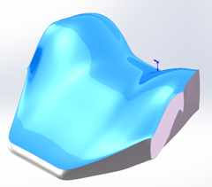
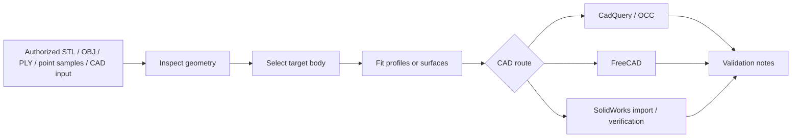
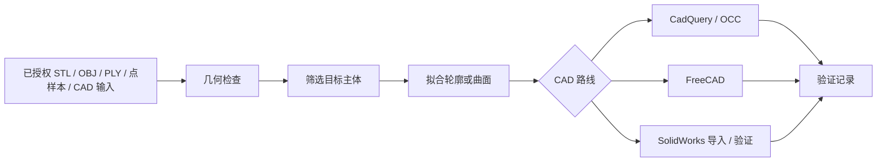

# Curved Surface Reconstruction

## Language

[English](#english) | [中文](#中文)

---

<a id="english"></a>

## English

<p align="center">
  <strong>Mesh and point-sample based workflow for curved-surface reconstruction and CAD handoff.</strong><br />
  Inspect source geometry, isolate the target body, fit profiles, export CAD-ready files, and keep validation records with the result.
</p>

<p align="center">
  
  
  
  
</p>

<p align="center">
  
</p>

### Overview

This repository collects a practical reconstruction workflow for curved products, soft parts, and closed solids. It is aimed at cases where mesh or point-sample data needs to be converted into cleaner section profiles, a STEP solid, or a documented CAD handoff.

The project does not try to be a fully automatic mesh-to-solid converter. The emphasis is on the engineering steps that usually determine whether the final geometry is useful: checking the source, choosing the real target body, fitting stable sections, exporting through a CAD backend, and documenting the validation result.

Typical outputs include inspected mesh data, profile JSON, STEP and preview STL files, optional SolidWorks import checks, and short reconstruction notes.

### Workflow Specification

The workflow is also packaged as an AgentSkill:

```text
SKILL.md
```

`SKILL.md` records the operating rules for reconstruction tasks: supported inputs, quality levels, main-body selection, section fitting, end-cap handling, adapter selection, and validation requirements.

### Gallery

<table>
  <tr>
    <td align="center">
      
      <br />
      <strong>Component classification</strong><br />
      Multi-part meshes are inspected as scenes first, so straps, seam loops, and thin decorative surfaces do not get fitted into the main cushion body.
    </td>
    <td align="center">
      
      <br />
      <strong>Single-solid soft-body reconstruction</strong><br />
      The retained cushion body is rebuilt from spline sections after accessory geometry is removed from the fit.
    </td>
  </tr>
</table>

### What This Repository Provides

- mesh and point-sample inspection before fitting;
- target-body filtering for scenes with straps, seams, labels, brackets, thin sheets, or scan fragments;
- ordered profile generation for section-based reconstruction;
- STEP and preview STL export through CAD adapters;
- optional SolidWorks import checks for body count and face statistics;
- validation records stored next to the generated output;
- explicit separation between mesh repair, STEP import, BREP solid generation, and true native CAD feature reconstruction.

### Reconstruction Flow



### Quality Levels

| Level | Output | Typical use |
| --- | --- | --- |
| Q0 | Cleaned mesh | Preview, concept checks, print checks |
| Q1 | Fitted profiles or surface data | Section analysis and reconstruction iteration |
| Q2 | Single BREP solid | STEP handoff and one-body deliverables |
| Q3 | Tool-native feature model | Editable sketches, splines, lofts, cuts, and named features |
| Q4 | Verified native deliverable | Native file plus independent body/topology verification |

### Current Scope And Limits

- Core readers currently support binary STL, OBJ, ASCII PLY, XYZ, PTS, and CSV point samples.
- STEP and BREP workflows are handled through CAD adapters, not through the core point-sampling script.
- The SolidWorks adapter currently imports and verifies STEP-derived SLDPRT files. It does not rebuild a native SolidWorks feature tree from sketches, splines, lofts, cuts, or named features.
- `core/surface_profiles_from_samples.py` is a height-field-style route. It works for curved blocks and target faces, but it is not a general solution for every closed freeform object.
- Complex soft parts should use case-specific or multi-spline section workflows, as shown in the H3 headrest case.

### Quick Start

Install the core inspection tools:

```powershell
python -m pip install -r requirements-core.txt
```

Install the BREP/STEP route when CadQuery output is needed:

```powershell
python -m pip install -r requirements-cadquery.txt
```

Inspect a reference mesh:

```powershell
python core/verify_geometry.py examples/cases/m1009/input/M1009_curved_face_block_reference.STL --out examples/cases/m1009/_work/geometry_report.json
```

Inspect a multi-part scene before fitting:

```powershell
python core/mesh_scene_inspector.py path/to/mesh_or_directory `
  --out-json path/to/_work/mesh_scene_report.json `
  --out-tsv path/to/_work/mesh_scene_summary.tsv `
  --contact-sheet path/to/_work/mesh_scene_contact_sheet.png
```

Generate ordered profiles:

```powershell
python core/surface_profiles_from_samples.py examples/cases/m1009/input/M1009_curved_face_block_reference.STL --out examples/cases/m1009/_work/profiles.json --sections 20 --points 7
```

Build a single solid STEP:

```powershell
python adapters/cadquery/single_solid_from_profiles.py examples/cases/m1009/_work/profiles.json --step examples/cases/m1009/_work/single_solid.step --preview-stl examples/cases/m1009/_work/single_solid_preview.stl
```

A successful single-solid route should keep evidence such as:

```text
VALID True
SOLIDS 1
```

### Example Cases

#### H3 Audi Headrest Cushion

A soft-body case focused on main-body filtering. Straps, seam loops, and thin decorative geometry are excluded while the cushion volume is retained.

- Case notes: [examples/cases/h3-audi-headrest/case.md](examples/cases/h3-audi-headrest/case.md)
- Asset manifest: [examples/cases/h3-audi-headrest/asset-manifest.md](examples/cases/h3-audi-headrest/asset-manifest.md)

#### M1009 Curved Face Block

A compact single-solid case showing the CadQuery to SolidWorks handoff.

- Case notes: [examples/cases/m1009/asset-manifest.md](examples/cases/m1009/asset-manifest.md)

### Repository Layout

- `SKILL.md` - reconstruction workflow and quality rules.
- `core/` - tool-independent inspection, sampling, and fitting scripts.
- `adapters/` - CadQuery, FreeCAD, OCCT, and SolidWorks routes.
- `docs/` - workflow notes, command templates, and environment setup.
- `examples/` - sample cases, preview outputs, and reconstruction notes.
- `tests/` - smoke tests and validation helpers.

### Validation

Validation is treated as part of the output. A useful reconstruction should keep the basic geometry checks, source/output previews, included and excluded component lists, CAD body-count checks when available, and a clear statement of the achieved quality level.

### Safety And Scope

This repository is intended for user-owned or otherwise authorized geometry. If the source model is a commercial product or third-party design and the permission status is unclear, confirm the rights before reproducing it in detail.

The SolidWorks adapter is optional and Windows-only. Proprietary interop DLLs are not included.

### Contributing

When adding a new case, keep the case traceable: source asset, reconstruction command sequence, preview image, validation report, and a short note explaining what was learned.

### License

Released under the MIT License. See [LICENSE](LICENSE).

[Back to language switch](#language)

---

<a id="中文"></a>

## 中文

<p align="center">
  <strong>基于网格和点样本的曲面重建与 CAD 交付流程。</strong><br />
  检查源几何，筛选目标主体，拟合截面轮廓，导出 CAD 可交付文件，并保留验证记录。
</p>

<p align="center">
  
  
  
  
</p>

<p align="center">
  
</p>

### 项目概览

这个仓库整理了一套面向曲面产品、软体件和封闭实体的逆向建模流程。它适合把 STL、OBJ、PLY、点样本或 CAD 交接数据整理成更干净的截面轮廓、STEP 实体或带记录的 CAD 交付结果。

它不是一键式 mesh-to-solid 转换器。项目重点放在真正影响重建质量的工程步骤上：源数据检查、目标主体筛选、稳定截面拟合、CAD 后端导出和结果验证。

常见输出包括检查后的网格数据、profile JSON、STEP、预览 STL、可选的 SolidWorks 导入检查，以及简短的重建记录。

### 流程规范

主流程文件是：

```text
SKILL.md
```

`SKILL.md` 记录了重建任务的操作规则，包括支持的输入、质量等级、主体筛选、截面拟合、端盖处理、适配器选择和验证要求。

### 图示展示

<table>
  <tr>
    <td align="center">
      
      <br />
      <strong>部件分类</strong><br />
      多部件网格应先作为场景检查，避免绑带、缝线环和薄装饰面被错误拟合进主垫体。
    </td>
    <td align="center">
      
      <br />
      <strong>单实体软体重建</strong><br />
      排除附件几何后，用样条截面重建保留下来的主垫体。
    </td>
  </tr>
</table>

### 这个仓库提供什么

- 重建前的网格和点样本检查；
- 带有绑带、缝线、标签、支架、薄片或扫描碎片的场景主体筛选；
- 面向截面重建的有序 profile 生成；
- 通过 CAD 适配器导出 STEP 和预览 STL；
- 可选的 SolidWorks 导入检查，包括实体数量和面统计；
- 与输出文件一起保存的验证记录；
- 区分网格修复、STEP 导入、BREP 实体生成和真正的原生 CAD 特征重建。

### 重建流程



### 质量等级

| 等级 | 输出 | 典型用途 |
| --- | --- | --- |
| Q0 | 清理网格 | 预览、概念检查、打印检查 |
| Q1 | 拟合轮廓或曲面数据 | 截面分析和重建迭代 |
| Q2 | 单一 BREP 实体 | STEP 交付、单实体交付 |
| Q3 | 工具原生特征模型 | 可编辑草图、样条、放样、切除和命名特征 |
| Q4 | 已验证的原生交付物 | 原生文件加独立的实体/拓扑验证 |

### 当前范围与限制

- 核心读取器当前支持二进制 STL、OBJ、ASCII PLY、XYZ、PTS 和 CSV 点样本。
- STEP 和 BREP 流程通过 CAD 适配器处理，不通过核心点采样脚本直接处理。
- 当前 SolidWorks 适配器负责导入和验证 STEP 派生的 SLDPRT 文件，尚未从草图、样条、放样、切除或命名特征重建原生 SolidWorks 特征树。
- `core/surface_profiles_from_samples.py` 是高度场式路线，适合曲面块和目标面，但不是所有封闭自由曲面物体的通用方案。
- 复杂软体件建议采用案例专用或多样条截面流程，例如 H3 头枕案例。

### 快速开始

安装核心检查工具：

```powershell
python -m pip install -r requirements-core.txt
```

如果需要 CadQuery 的 BREP/STEP 路线，再安装：

```powershell
python -m pip install -r requirements-cadquery.txt
```

检查参考网格：

```powershell
python core/verify_geometry.py examples/cases/m1009/input/M1009_curved_face_block_reference.STL --out examples/cases/m1009/_work/geometry_report.json
```

拟合前先检查多部件场景：

```powershell
python core/mesh_scene_inspector.py path/to/mesh_or_directory `
  --out-json path/to/_work/mesh_scene_report.json `
  --out-tsv path/to/_work/mesh_scene_summary.tsv `
  --contact-sheet path/to/_work/mesh_scene_contact_sheet.png
```

生成有序轮廓：

```powershell
python core/surface_profiles_from_samples.py examples/cases/m1009/input/M1009_curved_face_block_reference.STL --out examples/cases/m1009/_work/profiles.json --sections 20 --points 7
```

生成单一实体 STEP：

```powershell
python adapters/cadquery/single_solid_from_profiles.py examples/cases/m1009/_work/profiles.json --step examples/cases/m1009/_work/single_solid.step --preview-stl examples/cases/m1009/_work/single_solid_preview.stl
```

成功生成单实体路线时，应该保留类似证据：

```text
VALID True
SOLIDS 1
```

### 典型案例

#### H3 Audi Headrest Cushion

该案例展示了主体筛选规则的实际用法：忽略绑带、缝线环和薄装饰几何，同时保留主要软垫体积。

- 案例说明：[examples/cases/h3-audi-headrest/case.md](examples/cases/h3-audi-headrest/case.md)
- 资源清单：[examples/cases/h3-audi-headrest/asset-manifest.md](examples/cases/h3-audi-headrest/asset-manifest.md)

#### M1009 Curved Face Block

该案例是更简洁的单实体路线，展示了 CadQuery 到 SolidWorks 的交付流程。

- 案例说明：[examples/cases/m1009/asset-manifest.md](examples/cases/m1009/asset-manifest.md)

### 仓库结构

- `SKILL.md` - 重建流程和质量规则。
- `core/` - 工具无关的检查、采样和拟合脚本。
- `adapters/` - CadQuery、FreeCAD、OCCT 和 SolidWorks 路线。
- `docs/` - 工作流说明、命令模板和环境配置。
- `examples/` - 示例案例、预览输出和重建说明。
- `tests/` - 冒烟测试和验证辅助工具。

### 验证

验证是输出的一部分。可交付的重建结果应保留基础几何检查、源模型/输出模型预览、包含和排除部件清单、可用的 CAD 实体数量检查，以及明确的质量等级说明。

### 安全与范围

本仓库用于用户自有或已授权的几何数据。如果源模型是商业产品或第三方设计，且授权不明确，应先确认权限，再进行详细复现。

SolidWorks 适配器是可选的，并且只适用于 Windows。仓库不包含专有的 interop DLL。

### 贡献指南

新增案例时，建议保留源资产或参考样本、重建脚本或命令序列、预览图、验证报告，以及简短案例说明。

### 许可证

本项目采用 MIT License。详见 [LICENSE](LICENSE)。

[返回语言切换](#language)
