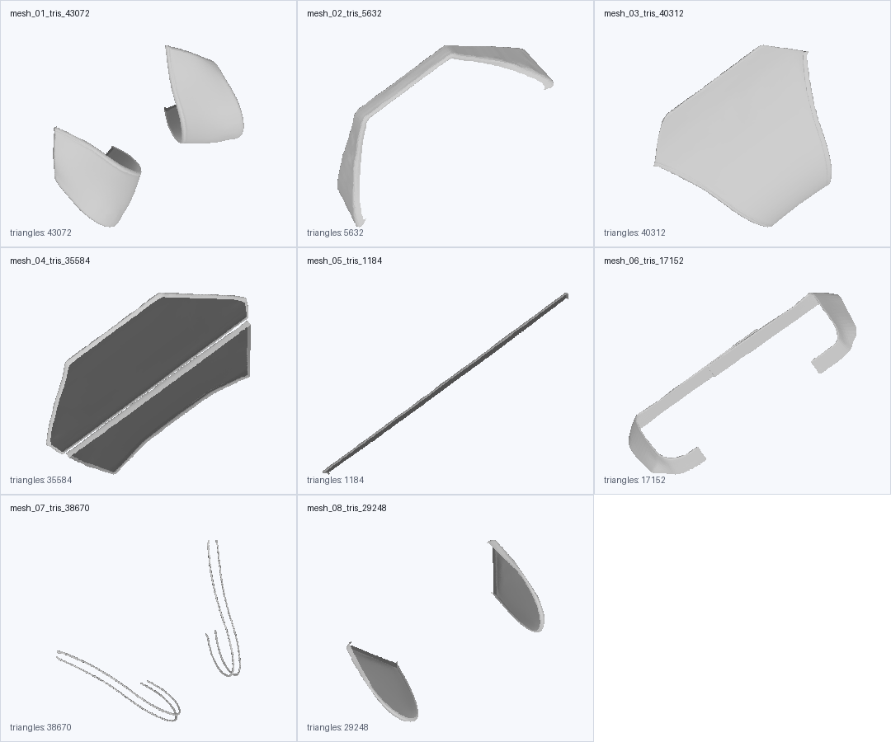
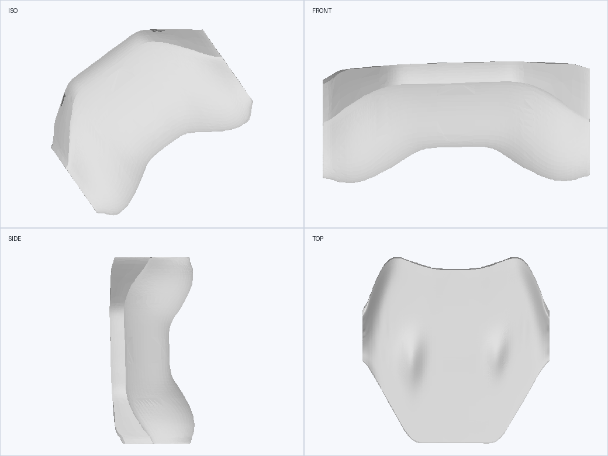
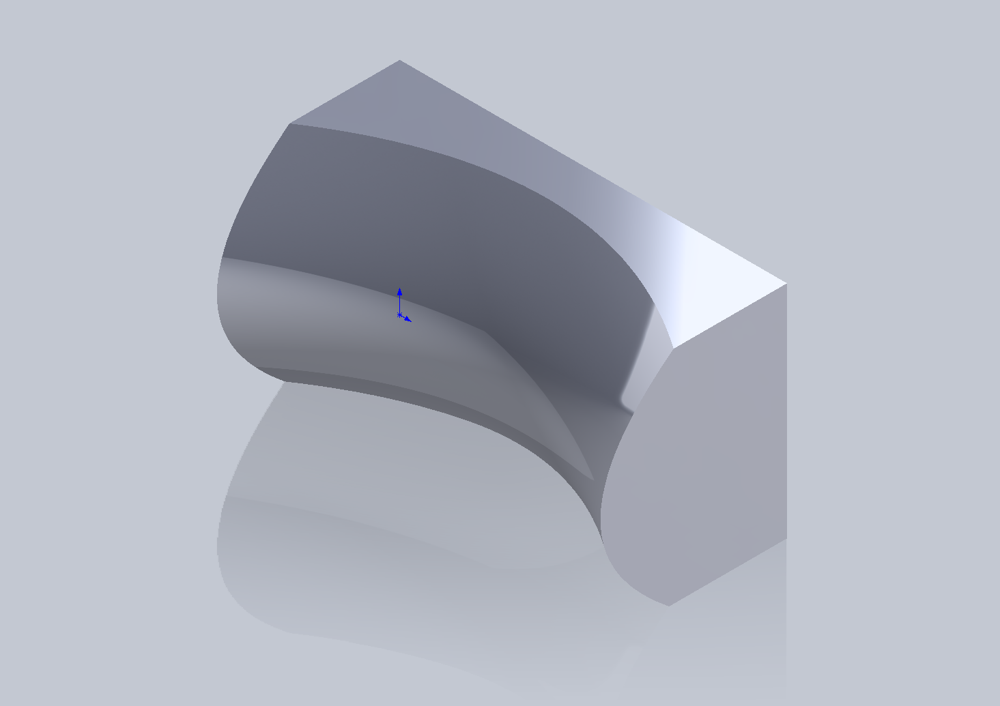
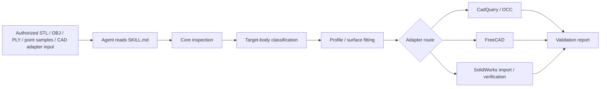

# Curved Surface Reconstruction AgentSkill

<p align="center">
  <strong>AgentSkill for tool-agnostic reverse modeling of curved products, soft goods, and closed solids.</strong><br />
  Guide an AI agent to inspect geometry, separate target bodies from detail parts, fit reconstruction profiles, export CAD-ready outputs, and report validation evidence.
</p>

<p align="center">
  
  
  
  
</p>

---

This repository packages an **AgentSkill** for curved-surface reconstruction. It is meant to be read and followed by an AI coding/CAD agent, not used as a blind mesh-to-solid converter. The skill defines when to inspect, when to segment, when to fit, which adapter route to use, and what validation evidence must be returned.

It supports workflows that rebuild freeform geometry into one of these output levels:

- cleaned mesh for preview or print checks;
- fitted profile data for design iteration;
- a watertight single BREP solid;
- a tool-native CAD deliverable with verification evidence.

The core is intentionally **tool-agnostic**. It handles inspection, component reasoning, sampling, profile generation, and validation reporting. CAD-specific work is kept in adapters for CadQuery/OCC, FreeCAD, OpenCascade, and SolidWorks.

## AgentSkill File

The main instruction file is:

```text
SKILL.md
```

Use it as the agent-facing contract for:

- activation criteria;
- safety and authorization rules;
- input/output expectations;
- quality levels Q0-Q4;
- main-body filtering rules;
- section and spline rules;
- end-cap/truncation rules;
- stop conditions;
- required validation evidence.

## Gallery

<table>
  <tr>
    <td align="center">
      
      <br />
      <strong>Source component classification</strong>
    </td>
    <td align="center">
      
      <br />
      <strong>Single-solid soft-body reconstruction</strong>
    </td>
  </tr>
</table>

<p align="center">
  
  <br />
  <strong>Compact STEP to SolidWorks deliverable</strong>
</p>

## What This AgentSkill Does

- tells an agent to inspect geometry before reconstruction, instead of trusting a preview;
- tells an agent to separate the target body from straps, seams, labels, brackets, thin sheets, and other accessories;
- provides scripts for ordered-section and fitted-surface generation;
- provides adapters for STEP and preview STL export;
- optionally imports and verifies STEP-derived parts in SolidWorks;
- requires validation of watertightness, manifold state, volume, body count, and visual fit;
- prevents the agent from overstating mesh-only or STEP-imported results as native editable CAD.

## Reconstruction Pipeline



## Quality Levels

| Level | Output | Best For |
| --- | --- | --- |
| Q0 | Cleaned mesh | Preview, concept checks, print checks |
| Q1 | Fitted surface profiles | Iteration, section analysis, reverse modeling |
| Q2 | Single BREP solid | STEP handoff, one-body deliverables |
| Q3 | Tool-native feature model | Editable CAD features in a target tool |
| Q4 | Verified native deliverable | Native file plus independent verification evidence |

## Current Scope And Limits

- Core readers currently support binary STL, OBJ, ASCII PLY, XYZ, PTS, and CSV point samples.
- STEP/BREP workflows are handled through CAD adapters, not through the core point-sampling scripts.
- The SolidWorks adapter currently imports and verifies STEP-derived SLDPRT files; it does **not** yet rebuild an editable SolidWorks feature tree from sketches, splines, lofts, cuts, and named features.
- `core/surface_profiles_from_samples.py` is a simple height-field-style route. It is useful for curved blocks and target faces, but not for every closed freeform object.
- Complex soft bodies should use case-specific or multi-spline section workflows, as shown in the H3 headrest case.

## Quick Start

Install the core inspection tools:

```powershell
python -m pip install -r requirements-core.txt
```

Install the BREP/STEP route as well if you want CadQuery output:

```powershell
python -m pip install -r requirements-cadquery.txt
```

Inspect a reference mesh:

```powershell
python core/verify_geometry.py examples/cases/m1009/input/M1009_curved_face_block_reference.STL --out examples/cases/m1009/_work/geometry_report.json
```

Inspect a multi-part scene before fitting:

```powershell
python core/mesh_scene_inspector.py path/to/mesh_or_directory `
  --out-json path/to/_work/mesh_scene_report.json `
  --out-tsv path/to/_work/mesh_scene_summary.tsv `
  --contact-sheet path/to/_work/mesh_scene_contact_sheet.png
```

Generate ordered profiles:

```powershell
python core/surface_profiles_from_samples.py examples/cases/m1009/input/M1009_curved_face_block_reference.STL --out examples/cases/m1009/_work/profiles.json --sections 20 --points 7
```

Build a single solid STEP:

```powershell
python adapters/cadquery/single_solid_from_profiles.py examples/cases/m1009/_work/profiles.json --step examples/cases/m1009/_work/single_solid.step --preview-stl examples/cases/m1009/_work/single_solid_preview.stl
```

Expected evidence for a successful single-solid route:

```text
VALID True
SOLIDS 1
```

## Featured Cases

### H3 Audi Headrest Cushion

This case is the strongest example of the skill's main-body filtering rule. It demonstrates how to ignore straps, seam loops, and thin decorative geometry while keeping the soft cushion mass intact.

- Case notes: [examples/cases/h3-audi-headrest/case.md](examples/cases/h3-audi-headrest/case.md)
- Asset manifest: [examples/cases/h3-audi-headrest/asset-manifest.md](examples/cases/h3-audi-headrest/asset-manifest.md)

### M1009 Curved Face Block

This case is a cleaner single-solid route that shows the CadQuery and SolidWorks handoff flow.

- Case notes: [examples/cases/m1009/asset-manifest.md](examples/cases/m1009/asset-manifest.md)

## Repository Layout

- `SKILL.md` - the main AgentSkill instruction file.
- `core/` - tool-independent inspection, sampling, and fitting logic.
- `adapters/` - CadQuery, FreeCAD, OCCT, and SolidWorks back ends.
- `docs/` - workflow, command templates, and environment matrix.
- `examples/` - curated cases, preview outputs, and reconstruction notes.
- `tests/` - smoke tests and validation helpers.

## Validation First

The skill treats validation as part of the deliverable:

- check bbox, counts, open edges, manifold state, and volume before fitting;
- compare source and output in consistent views;
- keep included and excluded component lists for multi-part scenes;
- prove final body count or validity in the target adapter before marking the task complete;
- label the achieved quality level instead of implying more editability than the output actually has.

## Safety And Scope

This repo is designed for user-owned or otherwise authorized geometry. If the source model is a commercial product or a third-party design and permission is unclear, confirm the rights before reproducing it in detail.

The SolidWorks adapter is optional and Windows-only. Proprietary interop DLLs are not bundled in the repository.

## Contributing

If you add a new case, keep the story complete:

1. a source asset or reference sample;
2. a reconstruction script or command sequence;
3. a preview image;
4. a validation report;
5. a short case note explaining what was learned.

## License

Released under the MIT License. See [LICENSE](LICENSE).
