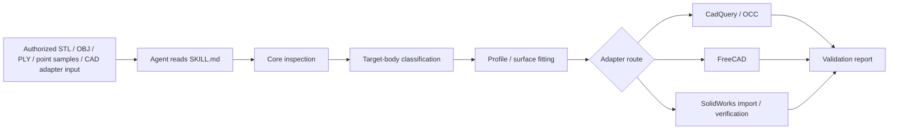
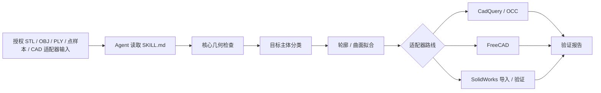

# Curved Surface Reconstruction AgentSkill

## Language

[English](#english) | [中文](#中文)

---

<a id="english"></a>

## English

<p align="center">
  <strong>AgentSkill for tool-agnostic reverse modeling of curved products, soft goods, and closed solids.</strong><br />
  Guide an AI agent to inspect geometry, separate target bodies from detail parts, fit reconstruction profiles, export CAD-ready outputs, and report validation evidence.
</p>

<p align="center">
  
  
  
  
</p>

### Overview

This repository packages an **AgentSkill** for curved-surface reconstruction. It is meant to be read and followed by an AI coding/CAD agent, not used as a blind mesh-to-solid converter. The skill defines when to inspect, when to segment, when to fit, which adapter route to use, and what validation evidence must be returned.

It supports workflows that rebuild freeform geometry into one of these output levels:

- cleaned mesh for preview or print checks;
- fitted profile data for design iteration;
- a watertight single BREP solid;
- a tool-native CAD deliverable with verification evidence.

The core is intentionally **tool-agnostic**. It handles inspection, component reasoning, sampling, profile generation, and validation reporting. CAD-specific work is kept in adapters for CadQuery/OCC, FreeCAD, OpenCascade, and SolidWorks.

### AgentSkill File

The main instruction file is:

```text
SKILL.md
```

Use it as the agent-facing contract for:

- activation criteria;
- safety and authorization rules;
- input/output expectations;
- quality levels Q0-Q4;
- main-body filtering rules;
- section and spline rules;
- end-cap/truncation rules;
- stop conditions;
- required validation evidence.

### Gallery

The figures below show the same three pieces of evidence that the skill asks an agent to preserve: component classification before fitting, final soft-body reconstruction, and compact single-solid handoff.

<table>
  <tr>
    <td align="center">
      
      <br />
      <strong>Source component classification</strong><br />
      Shows why the source must be treated as a scene before fitting, so straps, seam loops, thin bands, and other details do not distort the main-body reconstruction.
    </td>
    <td align="center">
      
      <br />
      <strong>Single-solid soft-body reconstruction</strong><br />
      Shows the retained main cushion body after accessory geometry is excluded and spline-section lofting is validated as a single solid.
    </td>
  </tr>
</table>

<p align="center">
  
  <br />
  <strong>Compact STEP to SolidWorks deliverable</strong><br />
  Demonstrates the simpler curved-face block route: core profile generation, CadQuery/OCC solid construction, STEP export, and downstream CAD handoff.
</p>

### What This AgentSkill Does

- tells an agent to inspect geometry before reconstruction, instead of trusting a preview;
- tells an agent to separate the target body from straps, seams, labels, brackets, thin sheets, and other accessories;
- provides scripts for ordered-section and fitted-surface generation;
- provides adapters for STEP and preview STL export;
- optionally imports and verifies STEP-derived parts in SolidWorks;
- requires validation of watertightness, manifold state, volume, body count, and visual fit;
- prevents the agent from overstating mesh-only or STEP-imported results as native editable CAD.

### Reconstruction Pipeline



### Quality Levels

| Level | Output | Best For |
| --- | --- | --- |
| Q0 | Cleaned mesh | Preview, concept checks, print checks |
| Q1 | Fitted surface profiles | Iteration, section analysis, reverse modeling |
| Q2 | Single BREP solid | STEP handoff, one-body deliverables |
| Q3 | Tool-native feature model | Editable CAD features in a target tool |
| Q4 | Verified native deliverable | Native file plus independent verification evidence |

### Current Scope And Limits

- Core readers currently support binary STL, OBJ, ASCII PLY, XYZ, PTS, and CSV point samples.
- STEP/BREP workflows are handled through CAD adapters, not through the core point-sampling scripts.
- The SolidWorks adapter currently imports and verifies STEP-derived SLDPRT files; it does **not** yet rebuild an editable SolidWorks feature tree from sketches, splines, lofts, cuts, and named features.
- `core/surface_profiles_from_samples.py` is a simple height-field-style route. It is useful for curved blocks and target faces, but not for every closed freeform object.
- Complex soft bodies should use case-specific or multi-spline section workflows, as shown in the H3 headrest case.

### Quick Start

Install the core inspection tools:

```powershell
python -m pip install -r requirements-core.txt
```

Install the BREP/STEP route as well if you want CadQuery output:

```powershell
python -m pip install -r requirements-cadquery.txt
```

Inspect a reference mesh:

```powershell
python core/verify_geometry.py examples/cases/m1009/input/M1009_curved_face_block_reference.STL --out examples/cases/m1009/_work/geometry_report.json
```

Inspect a multi-part scene before fitting:

```powershell
python core/mesh_scene_inspector.py path/to/mesh_or_directory `
  --out-json path/to/_work/mesh_scene_report.json `
  --out-tsv path/to/_work/mesh_scene_summary.tsv `
  --contact-sheet path/to/_work/mesh_scene_contact_sheet.png
```

Generate ordered profiles:

```powershell
python core/surface_profiles_from_samples.py examples/cases/m1009/input/M1009_curved_face_block_reference.STL --out examples/cases/m1009/_work/profiles.json --sections 20 --points 7
```

Build a single solid STEP:

```powershell
python adapters/cadquery/single_solid_from_profiles.py examples/cases/m1009/_work/profiles.json --step examples/cases/m1009/_work/single_solid.step --preview-stl examples/cases/m1009/_work/single_solid_preview.stl
```

Expected evidence for a successful single-solid route:

```text
VALID True
SOLIDS 1
```

### Featured Cases

#### H3 Audi Headrest Cushion

This case is the strongest example of the skill's main-body filtering rule. It demonstrates how to ignore straps, seam loops, and thin decorative geometry while keeping the soft cushion mass intact.

- Case notes: [examples/cases/h3-audi-headrest/case.md](examples/cases/h3-audi-headrest/case.md)
- Asset manifest: [examples/cases/h3-audi-headrest/asset-manifest.md](examples/cases/h3-audi-headrest/asset-manifest.md)

#### M1009 Curved Face Block

This case is a cleaner single-solid route that shows the CadQuery and SolidWorks handoff flow.

- Case notes: [examples/cases/m1009/asset-manifest.md](examples/cases/m1009/asset-manifest.md)

### Repository Layout

- `SKILL.md` - the main AgentSkill instruction file.
- `core/` - tool-independent inspection, sampling, and fitting logic.
- `adapters/` - CadQuery, FreeCAD, OCCT, and SolidWorks back ends.
- `docs/` - workflow, command templates, and environment matrix.
- `examples/` - curated cases, preview outputs, and reconstruction notes.
- `tests/` - smoke tests and validation helpers.

### Validation First

The skill treats validation as part of the deliverable:

- check bbox, counts, open edges, manifold state, and volume before fitting;
- compare source and output in consistent views;
- keep included and excluded component lists for multi-part scenes;
- prove final body count or validity in the target adapter before marking the task complete;
- label the achieved quality level instead of implying more editability than the output actually has.

### Safety And Scope

This repo is designed for user-owned or otherwise authorized geometry. If the source model is a commercial product or a third-party design and permission is unclear, confirm the rights before reproducing it in detail.

The SolidWorks adapter is optional and Windows-only. Proprietary interop DLLs are not bundled in the repository.

### Contributing

If you add a new case, keep the story complete:

1. a source asset or reference sample;
2. a reconstruction script or command sequence;
3. a preview image;
4. a validation report;
5. a short case note explaining what was learned.

### License

Released under the MIT License. See [LICENSE](LICENSE).

[Back to language switch](#language)

---

<a id="中文"></a>

## 中文

<p align="center">
  <strong>用于曲面产品、软体产品和封闭实体逆向建模的工具无关 AgentSkill。</strong><br />
  指导 AI agent 完成几何检查、主体与细节分离、重建轮廓拟合、CAD 就绪输出导出，以及验证证据报告。
</p>

<p align="center">
  
  
  
  
</p>

### 项目概览

本仓库封装的是一个用于曲面重建的 **AgentSkill**。它面向 AI 编程/CAD agent 阅读和执行，不是一个盲目的 mesh-to-solid 自动转换器。该 skill 规定 agent 何时检查、何时分割、何时拟合、选择哪条适配器路线，以及最终必须返回哪些验证证据。

它支持把自由曲面几何重建到以下输出层级：

- 用于预览或打印检查的清理网格；
- 用于设计迭代的拟合轮廓数据；
- 水密的单一 BREP 实体；
- 带验证证据的工具原生 CAD 交付物。

核心流程刻意保持 **工具无关**。它负责检查、部件判断、采样、轮廓生成和验证报告；与具体 CAD 软件相关的工作放在 CadQuery/OCC、FreeCAD、OpenCascade 和 SolidWorks 适配器中。

### AgentSkill 文件

主说明文件是：

```text
SKILL.md
```

它是 agent 执行任务时的约束文件，包含：

- 触发条件；
- 安全与授权规则；
- 输入/输出要求；
- Q0-Q4 质量等级；
- 主体筛选规则；
- 截面与样条规则；
- 端盖与截断处理规则；
- 停止条件；
- 必须返回的验证证据。

### 图示展示

下列图片展示了该 skill 要求 agent 保留的三类相同证据：拟合前的部件分类、最终软体主体重建，以及紧凑单实体交付。

<table>
  <tr>
    <td align="center">
      
      <br />
      <strong>源部件分类</strong><br />
      说明为什么必须先把源模型当作一个场景处理，避免绑带、缝线环、薄带和其他细节影响主体重建。
    </td>
    <td align="center">
      
      <br />
      <strong>单实体软体重建</strong><br />
      展示排除附件几何后保留下来的主垫体，并通过样条截面放样验证为单一实体。
    </td>
  </tr>
</table>

<p align="center">
  
  <br />
  <strong>紧凑 STEP 到 SolidWorks 交付物</strong><br />
  展示更简单的曲面块路线：核心轮廓生成、CadQuery/OCC 实体构建、STEP 导出，以及后续 CAD 交付。
</p>

### 这个 AgentSkill 解决什么

- 要求 agent 在重建前先检查几何，而不是只看预览图；
- 要求 agent 将目标主体与绑带、缝线、标签、支架、薄片和其他附件分开；
- 提供有序截面和拟合曲面的生成脚本；
- 提供 STEP 和预览 STL 导出的适配器；
- 可选地在 SolidWorks 中导入和验证 STEP 派生零件；
- 要求验证水密性、流形状态、体积、实体数量和视觉拟合；
- 防止 agent 把 mesh-only 或 STEP 导入结果夸大成原生可编辑 CAD。

### 重建流程



### 质量等级

| 等级 | 输出 | 适用场景 |
| --- | --- | --- |
| Q0 | 清理网格 | 预览、概念检查、打印检查 |
| Q1 | 拟合曲面轮廓 | 设计迭代、截面分析、逆向建模 |
| Q2 | 单一 BREP 实体 | STEP 交付、单实体交付 |
| Q3 | 工具原生特征模型 | 目标 CAD 软件中的可编辑特征 |
| Q4 | 已验证的原生交付物 | 原生文件加独立验证证据 |

### 当前范围与限制

- 核心读取器当前支持二进制 STL、OBJ、ASCII PLY、XYZ、PTS 和 CSV 点样本。
- STEP/BREP 流程通过 CAD 适配器处理，不通过核心点采样脚本直接处理。
- 当前 SolidWorks 适配器负责导入和验证 STEP 派生的 SLDPRT 文件；它**尚未**从草图、样条、放样、切除和命名特征重建可编辑 SolidWorks 特征树。
- `core/surface_profiles_from_samples.py` 是一个简化的高度场式路线，适合曲面块和目标面，但不适用于所有封闭自由曲面物体。
- 复杂软体应使用案例专用或多样条截面流程，例如 H3 头枕案例。

### 快速开始

安装核心检查工具：

```powershell
python -m pip install -r requirements-core.txt
```

如果需要 CadQuery 的 BREP/STEP 路线，再安装：

```powershell
python -m pip install -r requirements-cadquery.txt
```

检查参考网格：

```powershell
python core/verify_geometry.py examples/cases/m1009/input/M1009_curved_face_block_reference.STL --out examples/cases/m1009/_work/geometry_report.json
```

拟合前先检查多部件场景：

```powershell
python core/mesh_scene_inspector.py path/to/mesh_or_directory `
  --out-json path/to/_work/mesh_scene_report.json `
  --out-tsv path/to/_work/mesh_scene_summary.tsv `
  --contact-sheet path/to/_work/mesh_scene_contact_sheet.png
```

生成有序轮廓：

```powershell
python core/surface_profiles_from_samples.py examples/cases/m1009/input/M1009_curved_face_block_reference.STL --out examples/cases/m1009/_work/profiles.json --sections 20 --points 7
```

生成单一实体 STEP：

```powershell
python adapters/cadquery/single_solid_from_profiles.py examples/cases/m1009/_work/profiles.json --step examples/cases/m1009/_work/single_solid.step --preview-stl examples/cases/m1009/_work/single_solid_preview.stl
```

成功生成单实体路线时，应看到类似证据：

```text
VALID True
SOLIDS 1
```

### 典型案例

#### H3 Audi Headrest Cushion

该案例最能体现本 skill 的主体筛选规则：忽略绑带、缝线环和薄装饰几何，同时保留柔性头枕垫的主体质量。

- 案例说明：[examples/cases/h3-audi-headrest/case.md](examples/cases/h3-audi-headrest/case.md)
- 资源清单：[examples/cases/h3-audi-headrest/asset-manifest.md](examples/cases/h3-audi-headrest/asset-manifest.md)

#### M1009 Curved Face Block

该案例展示了更简洁的单实体路线，以及 CadQuery 到 SolidWorks 的交付流程。

- 案例说明：[examples/cases/m1009/asset-manifest.md](examples/cases/m1009/asset-manifest.md)

### 仓库结构

- `SKILL.md` - 主 AgentSkill 指令文件。
- `core/` - 工具无关的检查、采样和拟合逻辑。
- `adapters/` - CadQuery、FreeCAD、OCCT 和 SolidWorks 后端。
- `docs/` - 工作流、命令模板和环境矩阵。
- `examples/` - 整理后的案例、预览输出和重建说明。
- `tests/` - 冒烟测试和验证辅助工具。

### 验证优先

本 skill 将验证作为交付物的一部分：

- 拟合前检查 bbox、数量、开边、流形状态和体积；
- 用一致视角比较源模型和输出模型；
- 对多部件场景保留包含/排除部件清单；
- 在目标适配器中证明最终实体数量或有效性，再标记任务完成；
- 明确标注实际达到的质量等级，避免夸大可编辑性。

### 安全与范围

本仓库用于用户自有或已授权的几何数据。如果源模型是商业产品或第三方设计，且授权不明确，应在详细复现前先确认使用权限。

SolidWorks 适配器是可选的，并且只适用于 Windows。仓库不会捆绑专有的 SolidWorks interop DLL。

### 贡献指南

如果新增案例，应保持案例链条完整：

1. 源资产或参考样本；
2. 重建脚本或命令序列；
3. 预览图；
4. 验证报告；
5. 简短案例说明，说明本次重建得到的经验。

### 许可证

本项目采用 MIT License。详见 [LICENSE](LICENSE)。

[返回语言切换](#language)
